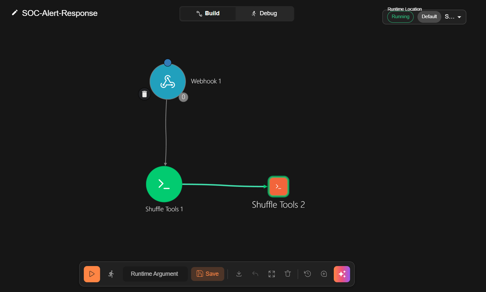
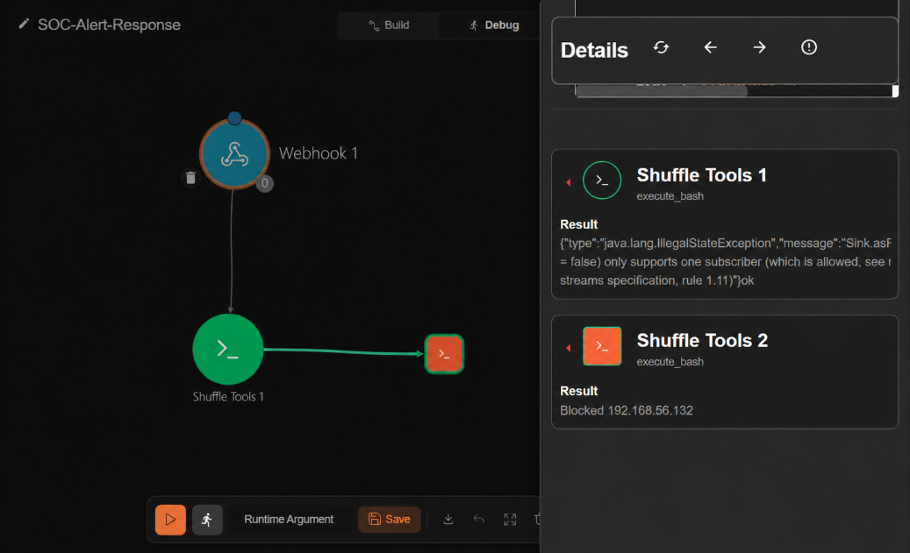

# 🤖 Shuffle SOAR Workflow

## Workflow: SOC-Alert-Response

### Diagram

```
[Webhook 1] ──────→ [Shuffle Tools 1: Execute Bash]
(trigger from Splunk)       │
                            ├── curl → TheHive REST API (create alert)
                            └── curl → Slack Incoming Webhook (notify)
                            ↓
                   [Shuffle Tools 2: Execute Bash]
                   (S4 Multi-stage only)
                            └── SSH → pfSense: pfctl -t blocklist -T add <src_ip>
```



---

## Webhook Trigger

- **Name**: Webhook 1
- **URL**: `http://192.168.1.129:3001/api/v1/hooks/<WEBHOOK_ID>`
- **Status**: Must be **Started** before Splunk can send triggers

Splunk sends a POST request to this URL when an alert fires. Sample payload:
```json
{
  "search_name": "S3 SSH Brute Force",
  "result": {
    "_raw": "May 17 suricata: ATTACK SSH Brute Force Detected {TCP} 192.168.56.132 -> 192.168.1.130:22",
    "src": "192.168.56.132",
    "dest": "192.168.1.130"
  }
}
```

---

## Shuffle Tools 1 — TheHive + Slack

**Action**: Execute bash

**Available Shuffle variables:**
| Variable | Source | Used by |
|----------|--------|---------|
| `$exec.search_name` | Splunk alert name | S3, S4, S5 |
| `$exec.result._raw` | Raw Suricata syslog | S3 |
| `$exec.result.description` | Enriched description field | S4, S5 |

**Command:**
```bash
curl -s -X POST http://192.168.1.129:9000/api/v1/alert \
  -H "Authorization: Bearer <THEHIVE_API_KEY>" \
  -H "Content-Type: application/json" \
  -d "{\"title\":\"$exec.search_name\",
       \"description\":\"$exec.result._raw$exec.result.description\",
       \"type\":\"suricata\",
       \"source\":\"splunk\",
       \"sourceRef\":\"splunk-$(date +%s)\",
       \"severity\":2,
       \"tags\":[\"suricata\",\"automated\",\"splunk\"]}" \
&& curl -s -X POST https://hooks.slack.com/services/<SLACK_WEBHOOK_PATH> \
  -H "Content-Type: application/json" \
  -d "{\"text\":\"🚨 *$exec.search_name*\n*Detail*: $exec.result._raw$exec.result.description\n*Time*: $(date)\"}"
```

---

## Shuffle Tools 2 — Auto Block IP on pfSense (S4 only)

**Action**: Execute bash  
**Trigger condition**: Only runs when `search_name` contains "S4"  
**Method**: SSH into pfSense → add attacker IP to `blocklist` table via `pfctl`

**Prerequisites:**
- SSH key from SOAR VM (`/home/nvphuong/.ssh/pfsense_key`) added to pfSense `authorized_keys`
- SOAR VM IP (`192.168.1.129`) added to pfSense Login Protection Pass List

**Command:**
```bash
if echo "$exec.search_name" | grep -q "S4"; then
  IP=$(echo "$exec.result.description" | grep -oE '[0-9]+\.[0-9]+\.[0-9]+\.[0-9]+' | head -1)
  if [ -n "$IP" ]; then
    ssh -i /home/nvphuong/.ssh/pfsense_key -o StrictHostKeyChecking=no root@192.168.1.1 "pfctl -t blocklist -T add $IP"
    echo "Blocked $IP on pfSense"
  else
    echo "No IP found in description"
  fi
else
  echo "Skipped - not S4"
fi
```

**Expected output:**
- S4 trigger: `Blocked 192.168.56.132 on pfSense`
- Other triggers: `Skipped - not S4`



**Verify block on pfSense:**
```bash
ssh -i /home/nvphuong/.ssh/pfsense_key root@192.168.1.1 "pfctl -t blocklist -T show"
```

**Note**: pfSense CE 2.8.1 does not include a REST API package in official repos. SSH + `pfctl` is used as a practical alternative for automated firewall control.

---

## TheHive Integration

**Endpoint**: `POST /api/v1/alert`  
**Auth**: Bearer token — API key of user `soar@thehive.local`  
**Organisation**: SOC

**Alert fields:**

| Field | Value | Description |
|-------|-------|-------------|
| title | `$exec.search_name` | Alert name from Splunk |
| description | `$exec.result._raw` + `$exec.result.description` | Raw log or enriched description |
| type | suricata | Alert type |
| source | splunk | Alert source |
| sourceRef | `splunk-<timestamp>` | Unique reference per alert |
| severity | 2 (MEDIUM) | Severity level |
| tags | suricata, automated, splunk | Filter tags |


---

## Slack Integration

**App**: SOC-Lab (Slack Incoming Webhook)

**Message format:**
```
🚨 *S4 Multi-stage Correlation*
Detail: Multi-stage attack from 192.168.56.132 (574 events in 5 min)
Time: Sun May 17 17:13:25 CEST 2026
```


---

## Important Notes

1. **Webhook must be Started** — click the Start button on Webhook 1 node before use
2. **TheHive API key** must belong to an `org-admin` user inside Organisation SOC — global admin key lacks `manageAlert` permission
3. **Shuffle variable syntax** — Shuffle does not support bash-style `${VAR:-default}` substitution; use `$exec.field_name` syntax only
4. **Schema learning** — Shuffle learns field names from execution history; the workflow needs at least one real Splunk trigger before autocomplete works
5. **Unique sourceRef** — use `$(date +%s)` to generate a unique reference per alert; duplicate sourceRef causes TheHive to reject with 400 error
6. **pfSense blocklist persistence** — the `blocklist` table is reset on pfSense reboot; for persistent blocking, add rules to pfSense firewall via Web UI

---

## Troubleshooting

| Error | Root Cause | Solution |
|-------|-----------|---------|
| `Failed finding 'exec.search_name'` | Shuffle has not learned the schema yet | Trigger once from real Splunk alert |
| TheHive 403 Forbidden | API key lacks permission | Create org-admin user in Organisation SOC |
| TheHive 400 Invalid json (sourceRef) | Duplicate sourceRef | Use `$(date +%s)` for unique reference |
| `IllegalStateException` (fanout) | Workflow triggered twice simultaneously | Normal behavior, does not affect output |
| Slack `invalid_token` | Webhook URL was truncated | Verify the full webhook URL |
| `bad substitution` in bash | Shuffle container uses sh, not bash | Avoid `${VAR:-default}` syntax |
| SSH timeout to pfSense | SOAR VM IP not in pfSense Pass List | Add 192.168.1.129 to Login Protection Pass List |
| `pfctl: Table does not exist` | blocklist table not yet created | Table auto-created on first `pfctl -t blocklist -T add` |
